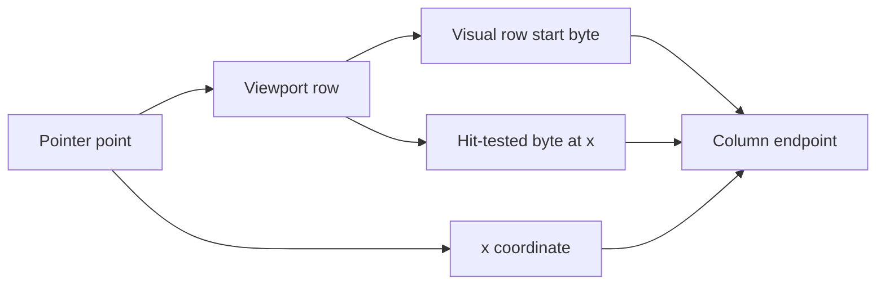
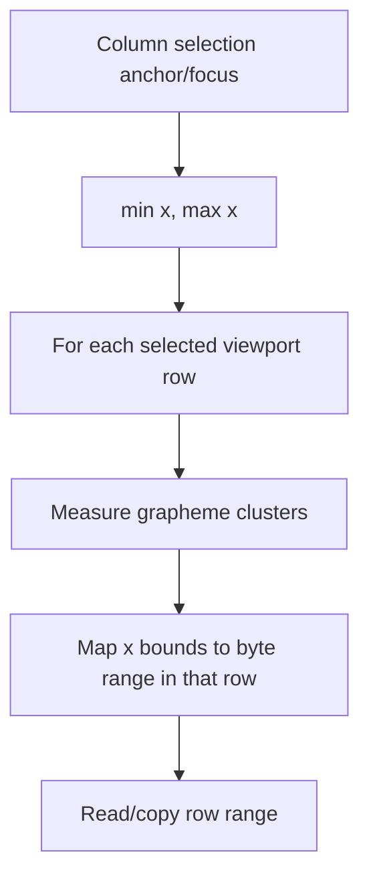

# Column Selection

## Context

Column selection lets the user select a rectangular visual area instead of one contiguous byte
range. In the UI this is started with Option/Alt pointer interaction, optionally with Shift to
extend an existing column selection.

The feature must work in the same runtime environment as normal viewing:

- files can be much larger than heap
- rows can be very short or extremely long
- text can be UTF-8, UTF-16LE, or UTF-16BE
- visible columns are measured in pixels, not character indexes
- copy output is capped at 5 MiB
- the app should remain cancellable while copying
- no full-file row list or full-file line index may be built

Column selection is intentionally defined in viewport row coordinates and physical byte positions,
not in character columns. Variable-width text means "column 10" is not stable across rows. The
stable horizontal value is the x-coordinate in points/pixels.

## User Model

Supported gestures:

- Option/Alt click or drag starts a new column selection.
- Option/Alt + Shift click or drag extends the current column selection when possible.
- A completed column selection uses the same context menu path as ordinary selection.
- The platform copy shortcut copies the selected text: Command-C on macOS, Ctrl-C on Windows/Linux.
- Escape cancels an active copy operation. Ctrl-C also cancels an active copy operation when it is
  handled as the explicit cancel shortcut.
- Starting another text copy cancels the previous active text copy.

Column selection is invalidated when soft wrap mode changes. A selection made from wrapped visual
rows is not necessarily meaningful after switching to unwrapped physical rows, and the UI should not
copy stale hidden selection contents.

## Selection Data Model

Conceptually, selection state has three forms:

- no selection
- a normal selection represented by one physical byte range
- a column selection represented by two endpoints, an anchor and a focus

Each column endpoint stores three values:

- hit-tested byte position: the exact byte under the pointer at that row and x-coordinate
- visual row start byte position: the start of the visual row that contained the pointer
- horizontal x-coordinate: the visual column edge in points/pixels

The implementation name for the visual row start field is `rowStartBytePosition`. This field is
called out because it is the vertical coordinate of the column selection. It is different from the
hit-tested byte position, which may be in the middle of the row.

Examples:

- Soft wrap off, line 3 starts at byte `200`, the user clicks 50 px from the left, and hit testing
  lands at byte `216`. The endpoint stores hit byte `216`, row start `200`, and x = 50 px.
- Soft wrap on, one very long physical line starts at byte `1000`, but its third wrapped visual row
  starts at byte `1128`. If the user starts a column selection on that third visual row at x = 40 px
  and hit testing lands at byte `1135`, the endpoint stores hit byte `1135`, row start `1128`, and
  x = 40 px. The vertical coordinate is not the physical line start `1000`, because copying must
  begin from the selected visual row, not from the whole physical line.
- During copy, the endpoint byte positions are not reused for every row. The x-values from the two
  endpoints form the left/right visual bounds, and each row maps those x-values to its own byte
  range.

The visual row start is stored separately from the hit-tested byte position because they answer
different questions. The hit-tested byte position identifies the exact byte under the pointer, which
can be in the middle of a visual row. The visual row start identifies the row itself. Column
selection needs that row identity to decide which rows are vertically inside the selection and to
iterate lazily from the anchor row to the focus row.

Using the hit-tested byte position as the row boundary would be ambiguous. For example, if a wrapped
visual row starts at byte `1128` and the user clicks at byte `1135`, the value `1135` says where the
horizontal hit landed, but not where the row begins. The copy path would have to rediscover the
containing visual row start before it could iterate selected rows correctly. That rediscovery
depends on wrap mode, viewport width, layout, and text measurement. Storing the visual row start
captures the vertical coordinate once while keeping the selection state constant-size.

The most important property is that a column selection stores only two endpoints. It does not store
one range per row. A selection spanning 10,000 rows and a selection spanning 10 rows have the same
selection-state size.



## Row Mapping

Column selection depends on a row model that separates three byte positions:

- visible start: first visible grapheme in the row text
- visual row start: start of the row as laid out on screen
- physical line start: start of the containing physical line

For soft wrap on, a single physical line can have many visual rows. In that case
the visual row start can be in the middle of a physical line.

For soft wrap off, one physical line is one visual row. In that case the visual row start should be
a physical line start, while the visible start can be shifted horizontally by the unwrapped
horizontal scroll position.

## Hit Testing

Pointer coordinates are converted to a column endpoint by:

1. Finding the visual row under the pointer y-coordinate.
2. Converting the pointer x-coordinate to a byte position in that row.
3. Storing the row start and x-coordinate.

The byte conversion walks grapheme clusters in the row text and measures each cluster through the
text layouter. Selection endpoints are therefore grapheme-safe and use the same visual units as
rendering.

The x-coordinate is retained because different rows can contain different character widths. Copy
does not reuse the endpoint byte positions for every row; it recomputes the row-local byte range
from the stored x-range for each row.



## Copy Algorithm

Copying has two paths:

- normal selection reads one physical byte range
- column selection iterates viewport rows lazily between the two endpoint row starts

For a column selection, each row is processed as follows:

1. Check for cancellation.
2. Derive the selected byte range for the current row.
3. Skip separator-only synthetic rows produced by wrapped-line layout.
4. Append a newline before every copied row after the first.
5. Read only that row range.
6. Stop when the 5 MiB copy limit is reached.

The per-row byte range derivation is:

1. If there is no selection, the range is empty.
2. If this is a normal selection, the stored physical byte range is used directly. It is not
   row-local, because normal selection copy is a single contiguous read.
3. If this is a column selection, order the two endpoint row starts to get the inclusive vertical
   span.
4. If the current row start is outside that vertical span, the range for this row is empty.
5. If the row is inside the vertical span, order the two endpoint x-coordinates to get the left and
   right visual bounds.
6. Map those x-bounds to byte positions in the current row. Each bound is resolved by walking the
   row's grapheme clusters from left to right, measuring each cluster, and accumulating both visual
   width and encoded byte length until that x-position is reached. For one row this costs
   `O(X)`, where `X` is the bytes of row text from the row start to the farther selected horizontal
   edge. An end user can estimate `X` from the visible column position: for ASCII log text, column
   200 is roughly 200 bytes; for non-ASCII or combining text, the byte count can be larger than the
   displayed character count. The row is measured cluster by cluster, but each cluster contributes
   its own bytes to `X`, so a separate grapheme-count variable is not needed. The selected range is
   the half-open byte range between those two positions.

This means the stored endpoint byte positions are not reused as per-row copy bounds. They identify
where the original pointer hits landed, while copying recomputes each selected row's byte range from
the stored visual x-bounds. This is necessary because the same x-coordinate can correspond to
different byte offsets on different rows.

The selected text is assembled into one bounded output buffer. This is acceptable because text copy
is capped at 5 MiB. The selection itself can describe an arbitrarily tall area, but the copied
result cannot grow without bound.

## Lazy Row Iteration

Column copy does not materialize all selected rows. The row layout layer lays out bounded batches of
rows and processes each row in order.

```text
current row start = first endpoint row start
while current row start is before or at the last endpoint row start:
    layout a bounded row batch from the current row start
    emit all rows except the lookahead row
    advance to the lookahead row start
```

The batch size is based on how many rows fit in the viewport, plus a small amount of lookahead. For
example, if the viewport can display 80 rows, the row layout layer can process roughly one viewport
of rows at a time, plus one lookahead row used to find the next batch start. A selection spanning
50,000 rows is therefore processed as many bounded batches of about viewport size, not as one
50,000-row layout result.

The final row in each batch is treated as lookahead. It is used as the next batch start without
duplicating a row at the batch boundary.

## Soft Wrap On

With soft wrap on, rows are visual rows. A column selection can begin on the second or third wrapped
row of a physical line. The anchor must store that visual row start, not the physical line start,
otherwise copying can prepend an extra line break or select bytes from the wrong segment.

This is why column selection stores the visual row found during hit testing. Inferring the row start
from an arbitrary byte position is not enough for wrapped continuation rows.

When iterating wrapped rows, reaching the end of a physical line must advance to the next physical
line start, not to the line-feed byte. Otherwise a separator-only empty row appears in the copy.
Those rows are also defensively skipped in the copy path when they have empty text and are not real
physical empty lines.

## Soft Wrap Off

With soft wrap off, rows are physical lines. Column selection does not introduce a new physical-line
discovery algorithm in this mode. It reuses the unwrapped row traversal described in
[Soft Wrap Modes And Unwrapped Long-Line Navigation](soft-wrap-modes.md), including raw line-feed
scanning, bounded line-boundary caches, and local rendering of long physical lines.

The column-selection-specific behavior is:

- each selected row is a physical line, not a wrapped visual segment
- the endpoint row starts must therefore be physical line starts
- per-row copy still maps the stored x-bounds to byte positions in the current physical line
- the copy loop remains lazy and stops at the 5 MiB output cap or cancellation point

## Soft Wrap Toggle Invalidates Column Selection

A column selection made in soft-wrap mode can refer to wrapped continuation rows whose visual row
starts are in the middle of a physical line. After soft wrap is turned off, those rows no longer
exist in the unwrapped row model. The selection is invalidated instead of being translated from
wrapped visual rows into physical-line rows.

The UI clears column selection state when soft wrap mode changes:

- anchor is cleared
- current column selection becomes empty
- active column gesture state is cleared
- context menu state is cleared
- active copy job is cancelled

The copy algorithm also contains a defensive guard. If soft wrap is off, a column selection whose
anchor or focus row start is not a physical line start copies nothing. This prevents stale UI state
from copying hidden bytes after a wrap-mode transition.

## Cancellation

Text copy runs as a cancellable asynchronous task. Column selection checks cancellation at row
boundaries, which bounds cancellation latency without adding a check to every byte or grapheme.

Cancellation points:

- Escape cancels active copy.
- Ctrl-C cancels active copy when it is handled as the explicit cancel shortcut.
- Starting another text copy cancels active copy.
- Disposing the viewer cancels active copy.
- Changing soft wrap mode while a column selection is active cancels active copy.

The platform copy shortcut is intentionally not the cancel shortcut. On macOS this is Command-C; on
Windows/Linux this is Ctrl-C. It starts a text copy and therefore cancels any previous text copy
before starting the new one. Ctrl-C is also available as the explicit cancel shortcut in contexts
where it is handled before starting a new platform-copy action.

The copy-in-progress message remains visible until success, failure, or cancellation. It is not
cleared by the normal toast timeout.

## Memory Constraints

Column selection memory is bounded by:

- two column endpoint values
- one row layout batch of `viewport row count + 1` rows, with a minimum of 2 rows; for example, a
  viewport that displays 80 rows uses batches of at most 81 row records
- one raw line-scan window capped at 4 MiB
- two bounded line-boundary caches, capped at 8,192 entries each
- the copied text result, capped at 5 MiB

The design explicitly avoids:

- storing one range per selected row
- storing one selection object per physical line
- building a full-file line index
- decoding an entire long physical line
- building a full-file character-to-byte table

For a selection spanning millions of physical rows, memory does not scale with selected row count.
Runtime can still scale with the number of rows needed to produce the capped output.

## Performance Constraints

The expected complexity depends on file shape:

Definitions:

- `B`: copied bytes, capped at 5 MiB.
- `R`: selected rows visited before copy stops. With soft wrap on, these are wrapped visual rows.
  With soft wrap off, these are physical lines.
- `V`: visible rows in the viewport. Row layout batches are `O(V)` because they use one viewport of
  rows plus lookahead.
- `X`: maximum bytes of row text from a row start to the farther selected horizontal edge among the
  visited rows.
- `P`: total byte length of physical lines touched by the visited rows when soft wrap is off. For many short lines, estimate it as
  the byte size of the selected vertical portion of the file. For one huge line, use that line's byte
  length. For several similar huge lines, use roughly `number of touched lines * bytes per line`.

No separate variable is needed for the number of physical lines in the soft-wrap-off rows below:
with soft wrap off, each visited row is already one physical line, so `R` covers that count.

| User-visible operation | Runtime complexity | Memory complexity |
| --- | --- | --- |
| Start or extend a column selection | `O(X)` per pointer update | `O(1)` for two endpoints |
| Copy a normal contiguous selection | `O(B)` | `O(B)` output memory |
| Copy a column selection with soft wrap on | `O(R * X + B)` | `O(B + V)` for copied output plus one row-layout batch |
| Copy a column selection with soft wrap off across many short lines | `O(R * X + P + B)` | `O(B + V)` plus bounded constants: one 4 MiB raw scan window and two 8,192-entry line-boundary caches |
| Copy a column selection with soft wrap off across many huge physical lines | `O(R * X + P + B)`; in this case `P` usually dominates because it includes the touched huge physical lines | `O(B + V)` plus bounded constants: one 4 MiB raw scan window and two 8,192-entry line-boundary caches |
| Copy a column selection with soft wrap off within one huge physical line | `O(X + P + B)`; this is the previous huge-line case with `R = 1` | `O(B + V)` plus one bounded 4 MiB raw scan window |
| Cancel an active copy | Column copy with soft wrap on: up to `O(X)` worst-case latency after the request.<br><br>Column copy with soft wrap off: up to `O(X + P)` as a conservative bound when cancellation arrives during one row's horizontal mapping and physical-line boundary work.<br><br>Normal contiguous copy:<br>`O(B)` worst-case latency because the current bounded read and trim must finish before cancellation is observed. | `O(1)` additional memory |
| Toggle soft wrap while a column selection is active | `O(1)` to invalidate the selection and request copy cancellation. If a column copy is already running, add up to `O(X)` for soft wrap on or `O(X + P)` for soft wrap off before it reaches the next cancellation point; normal viewport relayout cost is separate. | `O(1)` additional memory |

The feature cannot make a very narrow column over millions of rows constant-time. If each row
contributes only one byte plus a newline, producing 5 MiB still requires visiting millions of rows.
The practical mitigation is cancellation, bounded memory, and avoiding redundant rescans.

## Test Coverage

Automated tests cover:

- same-column copy across rows
- blank rows inside a column selection
- reversed drag
- wrapped continuation rows
- stale wrapped continuation selection after soft wrap is disabled
- stable endpoint selection after navigation
- multibyte/emoji byte ranges
- 5 MiB-style byte-limit trimming behavior with smaller test limits
- unwrapped physical-row traversal
- many short unwrapped rows with byte-limit stopping
- cancellation callback behavior

Pager tests cover the row-boundary and encoding machinery used by column selection:

- next-row navigation
- mixed soft-wrap/unwrapped navigation
- last-row navigation
- encoding-specific byte positions
