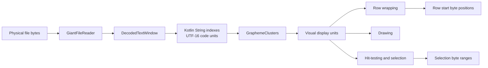
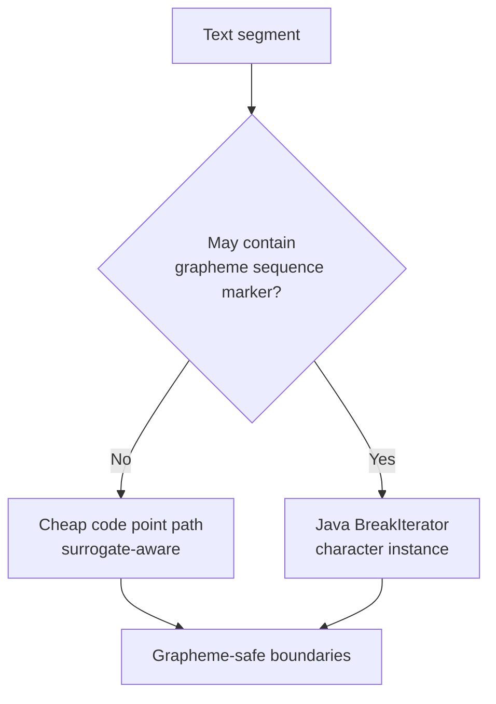
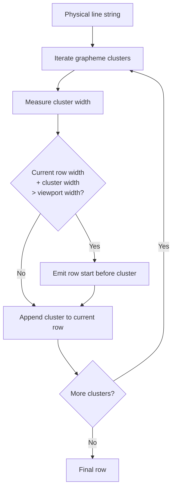
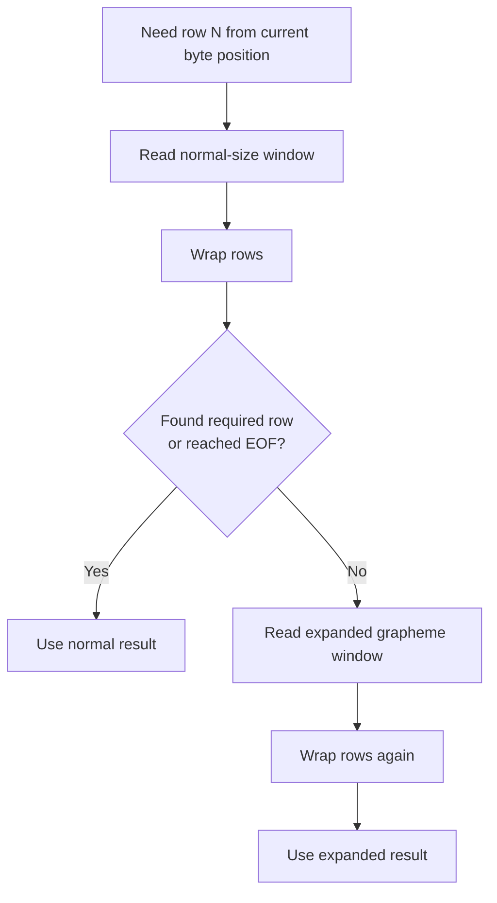
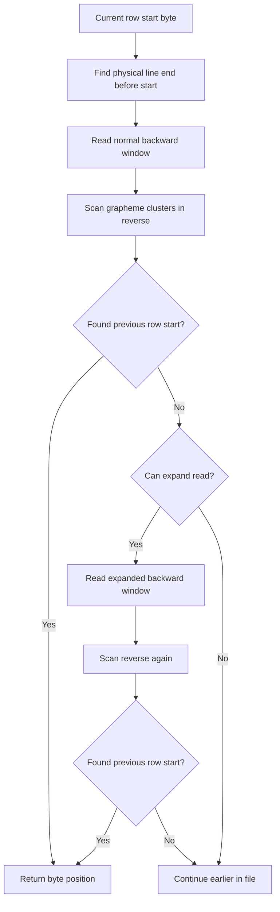
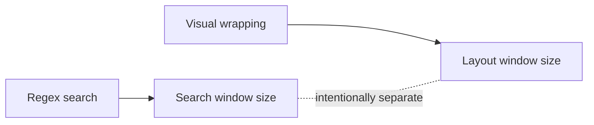
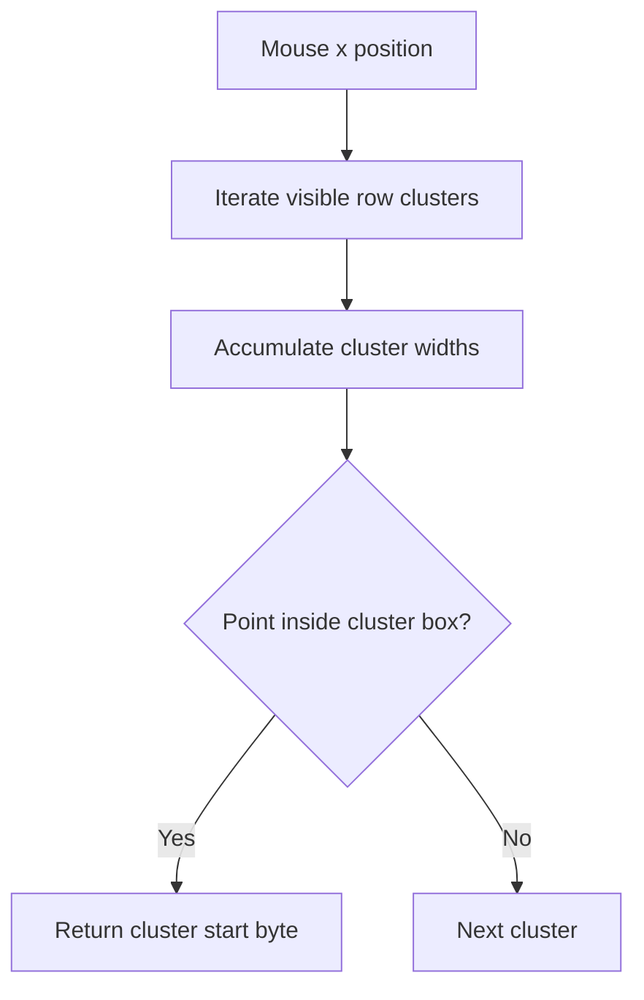

# Emoji Sequence Support

## Context

The viewer renders very large text files by physical byte position. That constraint does not change for emoji support: navigation, selection, search result ranges, and copy ranges are still byte ranges in the source file.

Emoji support adds another unit of text segmentation:

- **UTF-16 code unit**: Kotlin/JVM `String` indexing unit.
- **Code point**: Unicode scalar value; a non-BMP emoji is one code point but two UTF-16 code units.
- **Grapheme cluster**: user-visible character. Emoji sequences such as `👆🏿`, `👨‍👩‍👧‍👦`, `🇭🇰`, and `1️⃣` are one grapheme cluster but multiple code points.
- **Encoded bytes**: physical bytes in the file. These depend on UTF-8, UTF-16LE, or UTF-16BE.

The main invariant is:

> Display, wrapping, selection, hit-testing, copying, and row navigation must never split a grapheme cluster, while all persisted positions remain physical byte offsets.

## Why Code Point Support Was Not Enough

Before emoji sequence support, the pager was already careful not to split surrogate pairs. That made a simple emoji like `😄` work as one unit, but it did not handle sequences:

```text
👆🏿 = 👆 + 🏿
🇭🇰 = 🇭 + 🇰
1️⃣ = 1 + variation selector + enclosing keycap
👨‍👩‍👧‍👦 = emoji + ZWJ + emoji + ZWJ + emoji + ZWJ + emoji
```

Treating those as code points causes several user-visible bugs:

- soft wrapping can break inside a displayed emoji sequence
- selection endpoints can land between sequence components
- copy trimming can return a partial sequence
- backward row reconstruction can disagree with forward wrapping
- a row can appear to change length when navigating forward and back

## Text Unit Pipeline



`DecodedTextWindow` remains the bridge between string indexes and physical file bytes. Grapheme code never returns byte offsets directly; it returns safe string indexes, and the pager converts them with `DecodedTextWindow.bytePositionAtCharIndex()` or `GiantFileReader.encodedLength()`.

## Grapheme Boundary Strategy

`GraphemeClusters` has two paths:



The cheap path keeps common log files fast. It handles ordinary BMP characters and surrogate pairs without invoking `BreakIterator`.

The `BreakIterator` path is used when the text contains markers that commonly participate in grapheme sequences:

- zero-width joiner
- variation selectors
- emoji modifiers such as skin tones
- regional indicators
- tag characters
- combining marks

This is a performance heuristic. It is not a Unicode authority. `BreakIterator` is the authority when it is used.

## Future Emoji Compatibility

The implementation supports future emoji sequences only when both of these are true:

1. The sequence uses grapheme mechanisms recognized by `isGraphemeSequenceCodePoint()`.
2. The running JVM's `BreakIterator` knows the relevant Unicode rules.

If Unicode adds a new sequence marker that is not in the heuristic list, the fast path may incorrectly use code point iteration and split the new sequence.

More future-proof alternatives:

- Always use `BreakIterator`. This is simpler and more correct, but slower for large plain logs.
- Use a maintained Unicode grapheme library with an optimized iterator. This adds a dependency and update responsibility.
- Add a strict mode that always uses `BreakIterator`, while keeping the current fast mode for normal log viewing.

## Wrapping Model

Soft wrapping iterates grapheme clusters, measures each cluster, and emits row starts only at cluster boundaries.



Important rule:

> The cluster that overflows starts the next row. The row break is before that cluster, never inside it.

## Forward Row Navigation

Forward navigation needs enough decoded text to discover the requested visual row start.

For typical text, the old byte estimate is still used:

```text
requested bytes ~= display units needed * max bytes per code point
```

That is fast for ordinary logs. It fails for dense emoji-sequence lines because one display unit may contain many code points and many bytes.

So forward navigation uses adaptive reads:



The expanded window uses a conservative per-display-unit estimate:

```text
MAX_BYTES_PER_GRAPHEME_CLUSTER_ESTIMATE = 32
```

The expanded path is a fallback, not the default, because using it on every scroll makes normal scrolling much slower.

## Backward Row Navigation

Backward navigation is harder because the previous visual row start depends on wrapping earlier text in the same physical line.

The direct stepping path scans backward from the current row end:



The adaptive fallback is necessary for lines like repeated `🇭🇰👨‍👩‍👧‍👦1️⃣`, where a normal byte window can contain fewer visual units than expected.

## Why Adaptive Windows Are Required

The old estimate assumed:

```text
1 visual unit <= 1 code point <= maxBytesPerCharacter
```

That assumption is false for emoji sequences:

```text
1 visual unit = many code points = many encoded bytes
```

If the decoded window is too small, the pager may wrap only part of the intended viewport. That can make initial display, forward scrolling, and backward scrolling disagree.

The adaptive approach preserves speed for ordinary text:

```text
normal text:       one normal read
dense sequences:   normal read + expanded fallback read
```

## Search Is Intentionally Separate

Regex search uses bounded overlapping windows. It does not use the expanded grapheme layout window because that would change search behavior.



Search window size controls:

- maximum match span visible to one regex evaluation
- memory per search step
- regex runtime and backtracking risk
- compatibility with previous search behavior

Layout window size controls:

- whether enough visual rows can be decoded and wrapped
- whether grapheme sequences are split by navigation

These are different product constraints. Emoji support should not accidentally increase the regex search window.

User-facing limitation:

> Regex search works on bounded chunks of up to 4 MiB; matches spanning beyond a chunk may not be found.

## Selection, Hit-Testing, And Copying

Selection and mouse hit-testing use grapheme clusters for horizontal positions. A click inside a cluster maps to the cluster's starting byte position.

Copy trimming also removes whole grapheme clusters from the end when enforcing a byte limit. It must not trim only a skin-tone modifier, a ZWJ suffix, or a variation selector.



## Correctness Rules

The following must remain true:

- Row starts are grapheme boundaries.
- Selection start and end are grapheme boundaries.
- Copy output never contains partial grapheme clusters caused by trimming.
- Forward row movement and backward row movement agree on byte positions.
- All exposed positions are physical byte offsets, including BOM bytes.
- UTF-8 and UTF-16 byte ranges are computed through encoding-aware code, not by assuming one string index is one byte.

## Regression Cases

Core examples:

```text
👆🏿
👨‍👩‍👧‍👦
🇭🇰
1️⃣
á
```

Dense long-line example:

```text
🇭🇰👨‍👩‍👧‍👦1️⃣ repeated many times
```

Expected behavior for the dense case:

- no partial sequence is displayed
- forward wrapping produces stable row starts
- moving forward to the last wrapped row and then backward returns to the same earlier row starts
- display text does not change shape as navigation direction changes

## Performance Notes

Let:

- `N` = decoded string length in UTF-16 code units
- `C` = number of grapheme clusters
- `R` = number of visual rows
- `W` = average row width in clusters, so `C ~= R * W`

Common text without grapheme markers:

```text
Grapheme iteration: O(N), cheap path
Wrapping:           O(C)
```

Text with sequence markers:

```text
Marker gate:        O(N)
BreakIterator pass: O(N)
Wrapping:           O(C)
```

This is still linear, but with a higher constant.

Avoid this pattern in hot paths:

```text
for each row:
    boundaryAtOrBefore(wholeWindow, index)
```

Repeated whole-window boundary checks can become:

```text
O(R * N)
```

Prefer using indexes already produced by the grapheme iterator, or cache row/cluster metadata if the code is refactored later.

## Known Limitations

- The fast-path marker list must be maintained when Unicode introduces new grapheme-sequence mechanisms.
- Java `BreakIterator` behavior depends on the Unicode data and rules bundled with the running JVM.
- Adaptive fallback reads can be slower on dense emoji-sequence lines, but ordinary text should use normal-sized reads.
- Regex search remains bounded by search windows and is not a streaming regex engine.
- There is no whole-file grapheme index; all segmentation is local to decoded windows.

## Future Improvements

Possible next steps:

1. Replace the marker gate plus `BreakIterator` fallback with a single-pass grapheme iterator.
2. Store per-row cluster metadata from layout and reuse it for drawing, hit-testing, and selection.
3. Add a strict Unicode mode that always uses `BreakIterator`.
4. Add a benchmark for mostly ASCII logs, mixed Unicode logs, and dense emoji-sequence lines.
5. Consider a maintained Unicode grapheme library if future compatibility becomes more important than avoiding dependencies.
