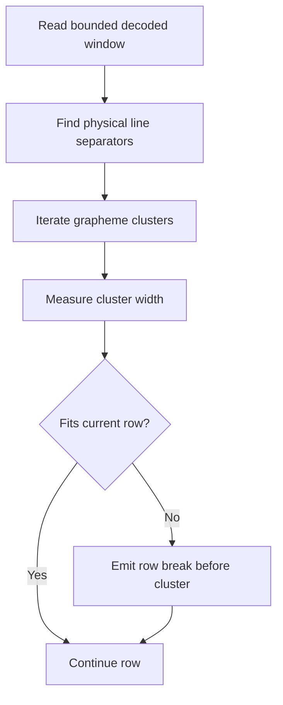
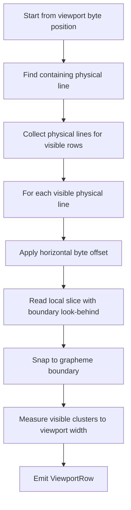
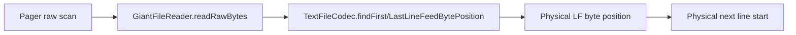
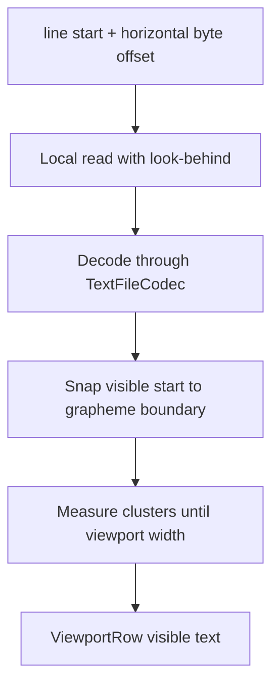

# Soft Wrap Modes And Unwrapped Long-Line Navigation

## Context

The viewer supports two display modes for file content:

- **Soft wrap on**: a physical line can occupy multiple visual rows based on viewport width.
- **Soft wrap off**: each physical line occupies exactly one visual row, and horizontal scrolling reveals content outside the viewport.

The default is soft wrap on. The wrap preference is application-session state, not file state and not persisted state. Switching files in the same process keeps the preference. Restarting the app resets it to the default.

This document focuses more on soft wrap off because that mode has the harder performance problem: a single physical line can be hundreds of MiB, but the viewer must still scroll vertically, scroll horizontally, and render near the end of the line without decoding the whole line.

## Main Invariants

- Public positions are physical byte offsets in the file.
- A BOM remains part of the physical file; displayable content starts after the BOM.
- The pager must not preload a whole file.
- The pager must not decode a whole huge physical line only because wrapping is off.
- Display, selection, hit testing, and copy ranges must not split grapheme clusters.
- The viewport row model must preserve enough byte metadata to keep selection and navigation correct.
- Caches must stay bounded because heap size is limited.
- Encoding-specific byte rules belong in `TextFileCodec`, not in common pager layout code.

## State Model

Soft wrap state lives above individual file view state:

```text
App session
    isSoftWrapEnabled: Boolean = true

Per pager / file view
    viewportStartBytePosition: Long
    viewportStartPhysicalLineBytePosition: Long
    horizontalScrollByteOffset: Long
    horizontalScrollPx: Float
```

`isSoftWrapEnabled` is passed down to `GiantTextViewer`, and the viewer calls `GiantFileTextPager.updateSoftWrapEnabled(...)`.

`horizontalScrollByteOffset` is per pager instance. This is intentional: horizontal position is meaningful relative to the currently viewed file and visible physical lines. When wrap is turned on, horizontal offset is reset to zero.

`horizontalScrollPx` is derived from byte offset and current text measurement. It is useful for UI display and for converting pointer or key deltas, but the byte offset is the authoritative horizontal position.

## Viewport Row Model

The pager uses `ViewportRow`:

```kotlin
internal data class ViewportRow(
    val text: String,
    val visibleStartBytePosition: Long,
    val rowStartBytePosition: Long,
    val physicalLineStartBytePosition: Long,
)
```

The fields have separate meanings:

- `text`: rendered visible text for this viewport row.
- `visibleStartBytePosition`: byte offset for the first visible grapheme in `text`.
- `rowStartBytePosition`: byte offset for the logical row start.
- `physicalLineStartBytePosition`: byte offset for the start of the containing physical line.

For soft wrap on, a physical line can produce many rows. `rowStartBytePosition` can differ from `physicalLineStartBytePosition`.

For soft wrap off, a row is a physical line. `rowStartBytePosition` and `physicalLineStartBytePosition` are normally the same, while `visibleStartBytePosition` moves horizontally within that physical line.

This distinction is what lets the toggle preserve vertical context. When switching modes, the pager can anchor to the physical line containing the previous first visible row instead of accidentally anchoring to a wrapped segment.

## Soft Wrap On

Soft wrap on is the simpler conceptual mode.

The pager reads a bounded decoded text window beginning at `viewportStartBytePosition`, lays out visual row breaks using viewport width, and emits `ViewportRow` instances. Wrapping iterates grapheme clusters and measures them. If a cluster would overflow the current row, the row break is emitted before that cluster.



The important constraints are:

- The decoded window is bounded.
- Row starts are grapheme boundaries.
- Row byte positions come from `DecodedTextWindow.bytePositionAtCharIndex(...)`.
- Forward movement can use adaptive windows when dense grapheme sequences make the normal estimate too small.
- Backward movement is harder because previous wrapped row starts depend on earlier text in the same physical line; it must remain bounded and may reread nearby chunks.

Soft wrap on does not need horizontal scrolling. If horizontal state is nonzero when wrap is enabled, it is cleared.

## Soft Wrap Off

Soft wrap off changes the row definition:

```text
one physical line = one viewport row
```

The hard case is:

```text
many short lines
one 160 MiB line
one 160 MiB line
one 160 MiB line
many short lines
```

The viewer must be able to:

- move vertically across short and long lines
- show a long line even when it starts near EOF
- move backward from EOF without jumping to BOF
- scroll horizontally near the end of a huge line
- avoid OOM when the scrollbar is clicked or dragged
- keep emoji sequence rendering stable while moving horizontally

The design uses physical byte positions for unwrapped layout and reads only local slices.

At a high level, wrap-off layout first treats the viewport as a list of physical lines, then applies the current horizontal byte offset to each visible line, and finally decodes only the visible slice.



The vertical and horizontal axes are intentionally separated:

- Vertical movement changes the physical line start.
- Horizontal movement changes the byte offset inside visible physical lines.
- Rendering combines both values into a bounded local read.

This is why wrap off remains usable near the end of a huge line: horizontal movement does not require replaying all bytes from the physical line start.

## Physical Line Boundary Discovery

In wrap-off mode, vertical navigation needs physical line starts. It must not decode all bytes between the current location and the next newline as text.

`GiantFileTextPager` uses raw byte scanning:

- `findNextPhysicalLineStartAfterRaw(...)`
- `findPhysicalLineStartAtOrBeforeRaw(...)`

These functions read at most `RAW_LINE_SCAN_CHUNK_BYTES` per scan step, currently 4 MiB. They delegate newline detection to `GiantFileReader`, which delegates to the active `TextFileCodec`.



The codec owns byte-level newline rules:

- UTF-8 LF is one byte: `0x0A`.
- UTF-16LE LF is the code unit `0A 00`.
- UTF-16BE LF is the code unit `00 0A`.
- UTF-16 scans align to code-unit boundaries relative to the content start byte.
- UTF-16 raw reads can request one extra byte so a code unit crossing the raw chunk boundary is still visible.

This keeps common pager logic independent of the concrete encoding.

## Bounded Line Boundary Caches

Raw scanning a 160 MiB no-newline region repeatedly would be too slow. The pager therefore keeps two bounded caches:

- `nextPhysicalLineStartCache`: maps `lineStart -> nextLineStart`.
- `lineKnownWithoutSeparatorUntilCache`: maps `lineStart -> knownUntil`.

`lineKnownWithoutSeparatorUntilCache` is important for long lines. If the pager has already scanned from the line start to byte `X` and found no separator, the next forward scan for that same line can resume at `X` instead of rescanning from the beginning.

Both caches are limited by `MAX_LINE_BOUNDARY_CACHE_ENTRIES`, currently 512. The maps are access-ordered `LinkedHashMap`s, so older entries are evicted. This keeps memory bounded and avoids building a whole-file line index.

## Unwrapped Row Layout

For wrap off, `layoutUnwrappedRowsFromAdaptiveWindow(...)` walks physical lines:

```text
rowStart = viewportStartBytePosition
while rows needed:
    nextLineStart = findNextPhysicalLineStartAfterRaw(rowStart)
    render one horizontal slice of rowStart
    rowStart = nextLineStart
```

The rendered text for each physical line is produced by `layoutUnwrappedPhysicalRow(...)`.

This function does not decode the whole physical line. Instead, it computes:

```text
targetBytePosition = lineStartBytePosition + horizontalScrollByteOffset
```

Then it reads a small decoded window around `targetBytePosition`:

- a byte look-behind of `HORIZONTAL_SLICE_LOOK_BEHIND_BYTES`, currently 1024
- a grapheme look-behind of `HORIZONTAL_SLICE_LOOK_BEHIND_CHARS`, currently 256
- enough bytes for the visible row width plus a small extra margin

The look-behind is needed because `targetBytePosition` can land in the middle of:

- a UTF-8 sequence
- a UTF-16 surrogate pair
- a grapheme cluster
- an emoji ZWJ sequence

The decoded window is then snapped to a safe grapheme boundary with `GraphemeClusters.boundaryAtOrAfter(...)`. The visible end is found by measuring grapheme clusters until viewport width is filled.



This is the core performance property for huge lines:

```text
cost ~= visible slice + small boundary buffer
cost != bytes from line start to horizontal position
cost != full physical line length
```

## Horizontal Scroll Position

The horizontal scrollbar uses byte offsets, not rendered pixel width over the whole line.

This was a deliberate choice. Pixel-accurate total width for a 160 MiB line would require measuring the whole line, which is not acceptable. Byte offset is cheap, stable, and already matches the viewer's physical-position model.

The scroll ratio is:

```text
visibleByteOffset / maxByteOffset
```

where `maxByteOffset` is the content byte length of the longest relevant visible physical line. The content byte length excludes the line separator.

When the first visible row is short but later visible rows are long, horizontal scrollability still needs to be available. Therefore horizontal metrics are selected from visible rows by the largest `maxByteOffset`, not only from the first row.

## Horizontal Key And Pointer Movement

Horizontal movement starts from pixels or ratios, but ends as byte offsets.

For direct scrollbar dragging:

```text
targetByteOffset = maxByteOffset * ratio
```

For key or trackpad movement:

```text
pixel delta -> estimated byte delta -> horizontalScrollByteOffset
```

Forward horizontal movement reads a small text window from the current byte position and walks grapheme clusters until the requested pixel width is covered.

Backward horizontal movement reads a small look-behind window ending at the current byte position and walks grapheme clusters in reverse until the requested pixel width is covered.

This keeps small shift-left/right movement accurate enough for emoji sequences while still avoiding a full-line measurement.

For large movement, such as a full canvas width, the cost is still bounded by the local read window needed to cover that movement.

## Estimating Pixel Position From Byte Offset

The UI still needs an approximate `horizontalScrollPx`.

`estimatedHorizontalScrollPxForByteOffset(...)` samples at most `MAX_HORIZONTAL_SCROLL_BYTE_SAMPLE_BYTES`, currently 64 KiB, from the physical line start. It counts grapheme clusters in that sample, computes a byte-to-cell ratio, and estimates the pixel position.

If the sample is empty or unusable, the fallback is:

```text
cells ~= byteOffset / minBytesPerCharacter
```

`minBytesPerCharacter` is provided by the codec:

- UTF-8: 1
- UTF-16: 2

This estimate is intentionally approximate. Exact pixel width for a huge line would require decoding and measuring the whole line.

The authoritative state remains the byte offset.

## Toggle Semantics

When toggling wrap mode, the first visible content should stay anchored to the same physical line.

Soft wrap on to off:

1. Find the physical line containing `viewportStartBytePosition`.
2. Set wrap off.
3. Set `viewportStartBytePosition` to the physical line start.
4. Keep horizontal byte offset unless policy says otherwise.
5. Rebuild viewport rows.

Soft wrap off to on:

1. Use the current physical line start.
2. Set wrap on.
3. Reset horizontal byte offset and pixel offset to zero.
4. Set `viewportStartBytePosition` to the physical line start.
5. Rebuild viewport rows.

The practical result is that toggling between modes does not jump to an unrelated part of the file. It may move from a wrapped segment to the beginning of its containing physical line, which is the intended anchor.

## Viewport Cache Key

The viewport cache must include:

- file length
- viewport start byte position
- viewport dimensions
- wrap mode
- horizontal pixel offset
- horizontal byte offset

Without wrap mode in the key, wrapped and unwrapped rows could be reused incorrectly. Without horizontal byte offset in the key, horizontal scrolling could update state while the rendered rows remain unchanged.

## Encoding Responsibilities

`TextFileCodec` owns:

- boundary-safe text decoding
- encoded length calculation
- raw LF scan read sizing
- first LF byte lookup in a raw buffer
- last LF byte lookup in a raw buffer
- line feed byte length
- minimum bytes per character for fallback estimates

The pager owns:

- viewport state
- row layout
- physical line navigation
- cache policy
- horizontal scroll state

This split matters because the pager should not switch on UTF-8 vs UTF-16 while doing layout. It asks the codec questions in physical-byte terms.

## Performance Analysis

Let:

- `L` = physical line length in bytes
- `V` = bytes needed to decode and render the visible horizontal slice
- `C` = raw scan chunk size, currently 4 MiB
- `R` = visible row count

For a long line with wrap off:

```text
rendering one visible row:        O(V)
horizontal small movement:        O(V)
horizontal ratio jump:            O(V) after setting byte offset
first scan to find line end:      O(L / C) raw chunks in worst case
repeat scan of same known region: reduced by line-known cache
memory for row text:              O(visible viewport text)
memory for boundary caches:       O(512 entries)
```

The remaining unavoidable cost is discovering physical line boundaries in a file that has very few separators. If a 160 MiB line has no newline, the first operation that needs to know its end may scan through it in 4 MiB raw chunks. That is disk I/O, but it does not allocate a 160 MiB string. After scanning, bounded caches make nearby navigation cheaper.

The design optimizes the common repeated interactions:

- scrolling horizontally within a known long line
- moving among recently viewed long lines
- toggling wrap mode near the current viewport
- rendering only the visible slice

It does not attempt to build a complete line index. That would make initial load and memory usage unacceptable for large files.

## Correctness Considerations

### Short Lines Before Long Lines

Horizontal scrollability cannot be based only on the first visible row. If the first visible row is short but a later visible row is long, the scrollbar and left/right movement must still work. Metrics are therefore derived from visible candidate rows and select the row with the largest content byte length.

### EOF And Backward Navigation

When the viewport is near EOF and the preceding content contains long lines, backward navigation must find the previous physical line by scanning backward in raw chunks. It must not give up and jump to the start of file unless no separator exists before the current position.

### Emoji And Grapheme Sequences

Horizontal byte offsets can land inside a grapheme sequence. The local read must include enough look-behind, and the visible start must be snapped to a grapheme boundary. Left/right movement walks grapheme clusters, not raw chars, so the same byte offset should not display different partial emoji sequences as the user moves horizontally.

### UTF-16 Alignment

Raw line scanning must respect UTF-16 code-unit boundaries. A byte value `0x0A` by itself is not enough to identify a UTF-16 newline. The codec aligns scan offsets to content-start-relative code-unit positions and checks the proper endian representation.

### Scrollbar Maximum

The horizontal scrollbar maximum is byte length, not pixel width. This avoids measuring huge lines and avoids bugs where emoji-heavy lines cannot reach the end because byte width and rendered width are not proportional.

## Memory Considerations

The implementation intentionally avoids:

- full-file line indexes
- full-line decoded strings for unwrapped long lines
- per-character byte tables for the whole file
- unbounded newline caches
- pixel-width tables for long lines

Allowed memory includes:

- `GiantFileReader` block cache
- one or two decoded windows
- current viewport rows
- small grapheme look-behind windows
- two 512-entry line-boundary caches

Any future optimization must preserve those bounds unless the app gains an explicit opt-in indexing mode.

## Testing Strategy

Important regression cases:

- default soft wrap is on
- wrap preference survives switching files in one session
- wrap preference resets after app restart
- toggling wrap off from a wrapped segment anchors to the containing physical line start
- toggling wrap on resets horizontal offset
- wrap off uses physical lines as rows
- left/right and trackpad horizontal movement work when the first visible row is short but later rows are long
- scrollbar dragging sets byte offset by ratio without OOM
- horizontal scrollbar can reach the end of ASCII long lines
- horizontal scrollbar can reach the end of emoji-sequence long lines
- EOF backward navigation can show preceding long lines instead of jumping to BOF
- UTF-8, UTF-16LE, and UTF-16BE line scanning find correct physical line starts
- mixed emoji sequences are not clipped or changed by left/right movement
- selection and hit testing use `visibleStartBytePosition` after horizontal scrolling

Large-file performance tests should include:

```text
many short lines
160 MiB physical line
160 MiB physical line
160 MiB physical line
many short lines
```

and a variant where the long lines are dense emoji sequences.

## Known Tradeoffs

- Exact pixel width of a huge line is not known. Byte offset is the horizontal scrollbar coordinate.
- The first boundary discovery pass over an unseen huge no-newline region can still require raw I/O over that region.
- Bounded caches improve local repeated navigation but do not remember every line in the file.
- Horizontal pixel estimates are approximate for variable-width and emoji-heavy text.
- The local slice look-behind is a practical bound. If Unicode introduces longer grapheme constructions, the constant may need adjustment or a stronger boundary strategy.

## Maintenance Rules

- Keep encoding byte decisions in `TextFileCodec`.
- Keep common pager layout in physical byte terms.
- Do not add code that decodes from physical line start to horizontal offset in wrap-off mode.
- Do not base horizontal scrollbar availability only on the first visible row.
- Do not replace byte-offset scrollbar semantics with full rendered-width measurement for huge lines.
- Keep line-boundary caches bounded.
- Any new row metadata must preserve physical line start and visible slice start separately.
